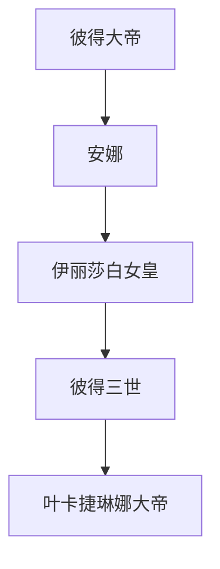

主要宗教： [[宗教#东正教]]
- 俄国获得“大帝”称号的君主只有两位，彼得大帝和叶皇。

> [!hint] 伊丽莎白一世的“好圣孙”计划
> 伊丽莎白发动政变，囚禁了伊凡后，一直需要一个合法的继承人。她自己确认生育可能性极小后，收养了自己亲姐姐的儿子彼得三世作为继承人。然而彼得阴暗、羸弱、愚蠢，且狂热崇拜普鲁士国王腓特列二世，自认精神普鲁士人，鄙视俄罗斯民族，宗教上也不认同东正教。于是伊丽莎白选妃，选定了德意志公主叶卡捷琳娜，希望借鸡生蛋生出娃，然后培养这个娃作为自己的继承人。

# 俄乌战争
