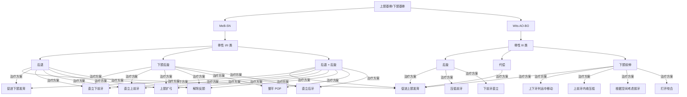

公元前五世纪，古希腊是西方文明早期达到的一个巅峰。

古希腊灭亡 -> 古罗马

> [!hint]
> 奇异的同频：公元前 5 世纪，中国文明、印度文明、古巴比伦和希腊文明几乎是同时发展兴盛起来。

古希腊的三位哲人（代表了古希腊文明的高峰）：

苏格拉底、柏拉图、亚里士多德

```mermaid
graph TD;
    A[上颌基骨/下颌基骨] --> B1[MeB-SN];
    A --> B2[Wits AO-BO];
    B1 --> C1[骨性 I/II 类];
    B2 --> C2[骨性 III 类];
    
    C1 --> D1[后退];
    C1 --> D2[下颌后旋];
    C1 --> D3[后退 + 后旋];
    C2 --> E1[后旋];
    C2 --> E2[代偿];
    C2 --> E3[下颌前伸];
    
    D1 -->|治疗方案| T1[促进上颌发育];
    D1 -->|治疗方案| T2[促进下颌发育];
    D1 -->|治疗方案| T3[直立下前牙];
    D1 -->|治疗方案| T4[直立上前牙];
    D1 -->|治疗方案| T5[上颌扩弓];
    D1 -->|治疗方案| T6[解除反颌];
    
    D2 -->|治疗方案| T3;
    D2 -->|治疗方案| T4;
    D2 -->|治疗方案| T5;
    D2 -->|治疗方案| T6;
    D2 -->|治疗方案| T7[整平 POP];
    D2 -->|治疗方案| T8[直立后牙];
    
    D3 -->|治疗方案| T1;
    D3 -->|治疗方案| T2;
    D3 -->|治疗方案| T3;
    D3 -->|治疗方案| T4;
    D3 -->|治疗方案| T5;
    D3 -->|治疗方案| T6;
    D3 -->|治疗方案| T7;
    D3 -->|治疗方案| T8;
    
    E1 -->|治疗方案| T1;
    E1 -->|治疗方案| T9[压低前牙];
    E1 -->|治疗方案| T10[下前牙直立];
    
    E2 -->|治疗方案| T1;
    
    E3 -->|治疗方案| T1;
    E3 -->|治疗方案| T11[上下牙列远中移动];
    E3 -->|治疗方案| T12[上前牙内收压低];
    E3 -->|治疗方案| T13[根据空间考虑拔牙];
    E3 -->|治疗方案| T14[打开咬合];
```

I 类 / II 类

下颌旋转正常

V 3 报告视图，

下颌后退